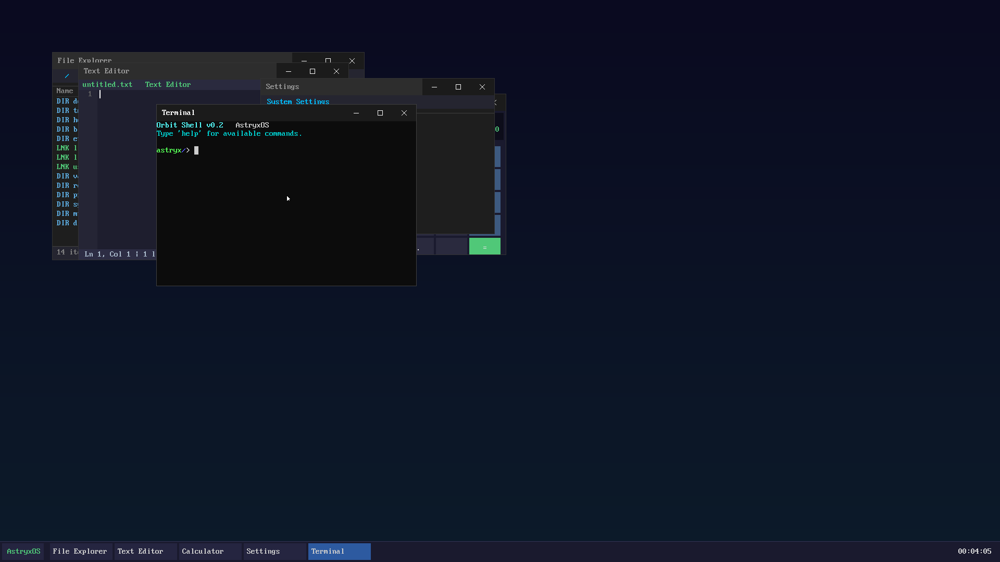

# AstryxOS

A UEFI-native x86_64 research operating system written in Rust, with an NT-inspired kernel that runs real Linux ELF binaries.

[](https://github.com/me1iissa/AstryxOS/actions/workflows/build.yml)
[](LICENSE)
[](#test-suite)
[](rust-toolchain.toml)



---

AstryxOS is a from-scratch operating system kernel (codename **Aether**) that takes the NT
subsystem model as its architectural inspiration: a microkernel-ish executive at the centre,
with personality subsystems layered above the HAL that give each application binary the illusion
of running on its native operating system. The practical result is that an unmodified
glibc-linked ELF binary executes inside AstryxOS today, and the long-horizon target is Firefox
rendering a page without any source modifications. The project is also an experiment in
agentic software development: most of the ~83 KLOC was written by Claude agents working in
parallel worktrees, with human review at merge time.

---

## Current status

- glibc-linked ELF hello world runs end-to-end (dynamic linker + glibc fully wired)
- 139 of 140 headless tests pass (one Win32 PE test gated behind a feature flag)
- 193 Linux syscalls dispatched; 50+ native Aether syscalls
- Firefox infrastructure installed on data disk; content process reaches 56K+ syscalls before
  hitting a non-canonical mmap return in `ld-linux.so.2` (next wave's focus)
- Full TCP/IP stack (IPv4, IPv6, 3WHS, FIN, retransmit, congestion control, DHCP, DNS)
- In-kernel X11 server with RENDER, MIT-SHM, XKB, XFIXES, SYNC, BIG-REQUESTS extensions
- FAT32 read-write, ext2 read-only, NTFS read-only, procfs, tmpfs
- ~83 KLOC across 170+ Rust source files

---

## Features

<details>
<summary>Kernel subsystems</summary>

| Subsystem | Description |
|-----------|-------------|
| `arch/` | x86_64: GDT, IDT, LAPIC, SMP, context switch, ISR delivery |
| `mm/` | PMM, VMM, slab heap, page tables, ASLR, OOM killer |
| `sched/` | SMP round-robin + priority scheduler (CoreSched) |
| `proc/` | Process/thread control blocks, ELF loader (static, PIE, dynamic), PE32+ loader |
| `vfs/` | VFS layer: ramfs, FAT32, ext2, NTFS, procfs, tmpfs |
| `net/` | Full TCP/IP: IPv4, IPv6, TCP, UDP, ARP, ICMP, DNS, DHCP |
| `x11/` | In-kernel X11 server with 7 extensions |
| `ipc/` | Pipes, Unix sockets, SysV SHM, timerfd, signalfd, inotify, PTY |
| `security/` | Capabilities (capget/capset), rlimits, prctl, PR_SET_NO_NEW_PRIVS |
| `gdi/` | GDI engine: device contexts, surfaces, BitBlt, text, regions |
| `gui/` | Window manager, compositor, terminal emulator, desktop |
| `nt/` | NT personality subsystem (Win32 ABI stub) |
| `ke/` | Core executive: spinlocks, DPCs, deferred work, wait/notify |
| `ob/` | Object manager: handles, reference counting |
| `hal/` | Hardware Abstraction Layer |
| `drivers/` | ATA PIO, AHCI DMA, virtio-blk, virtio-net, e1000, AC97, PS/2, xHCI, serial |

</details>

<details>
<summary>Syscall ABIs and filesystems</summary>

| ABI | Dispatch | Syscalls |
|-----|----------|----------|
| Linux x86_64 | `syscall` instruction | 193 handled |
| Native Aether | `INT 0x2E` | 50+ native calls |
| Win32 PE32+ | `INT 0x2E` (NT personality) | stub subsystem |

| Filesystem | Access | Notes |
|------------|--------|-------|
| ramfs | read/write | Root VFS, in-memory |
| FAT32 | read/write | Cluster allocator; create, write, truncate, unlink |
| ext2 | read-only | |
| NTFS | read-only | |
| procfs | read | /proc/self, /proc/PID, cpuinfo, meminfo, uptime, maps, fd/ |
| tmpfs | read/write | Mounted at /tmp via `sys_mount` |

</details>

<details>
<summary>Hardware drivers</summary>

| Category | Drivers |
|----------|---------|
| Block | ATA PIO, AHCI DMA, virtio-blk, partition table |
| Network | e1000, virtio-net |
| Audio | AC97 (`/dev/dsp`) |
| Input | PS/2 keyboard, PS/2 mouse |
| Display | Framebuffer, VMware SVGA stub |
| USB | xHCI enumeration (Tier 1 probe) |
| Serial | 16550 UART |
| Timer | PIT, LAPIC, HPET, RTC |

</details>

---

## Getting started

Full step-by-step instructions are in [docs/QUICKSTART.md](docs/QUICKSTART.md).

**Short version** (Ubuntu 22.04 / WSL2):

```bash
# 1. Install system dependencies
sudo apt-get install -y build-essential gcc musl-tools mtools qemu-system-x86 ovmf python3

# 2. Install Rust nightly
curl --proto '=https' --tlsv1.2 -sSf https://sh.rustup.rs | sh
source "$HOME/.cargo/env"
rustup toolchain install nightly && rustup component add rust-src --toolchain nightly

# 3. Clone and build
git clone <repo-url> AstryxOS && cd AstryxOS
./build.sh release
bash scripts/create-data-disk.sh

# 4. Run the test suite
python3 scripts/watch-test.py --idle-timeout 60 --hard-timeout 300
```

A passing run ends with `[PASS] 139/140 tests passed`.

---

## Documentation

| Document | Purpose |
|----------|---------|
| [docs/QUICKSTART.md](docs/QUICKSTART.md) | First-build guide; system dependencies, Rust setup, OVMF troubleshooting |
| [docs/HARNESS.md](docs/HARNESS.md) | `qemu-harness.py` subcommand reference for interactive debugging |
| [docs/DEVELOPMENT_PLAN.md](docs/DEVELOPMENT_PLAN.md) | Wave-based roadmap; current state, completed waves, next priorities |
| [docs/FIREFOX_PORT_ROADMAP.md](docs/FIREFOX_PORT_ROADMAP.md) | Firefox porting milestone tracker |
| [docs/SOURCE_REVIEW_2026-04-20.md](docs/SOURCE_REVIEW_2026-04-20.md) | Architecture snapshot from 2026-04-20 code review |
| [CONTRIBUTING.md](CONTRIBUTING.md) | Contributor routing page: human vs. AI agent guidance |
| [HUMAN_CONTRIBUTING.md](HUMAN_CONTRIBUTING.md) | Human contributor workflow: branches, commits, PRs, style |
| [AI_CONTRIBUTING.md](AI_CONTRIBUTING.md) | AI agent guide: worktrees, watchdog, pitfalls, test extension |
| [SECURITY.md](SECURITY.md) | Vulnerability reporting and disclosure policy |
| [CODE_OF_CONDUCT.md](CODE_OF_CONDUCT.md) | Contributor Covenant v2.1 |

---

## Project layout

```
AstryxOS/
├── bootloader/         # AstryxBoot — custom UEFI bootloader
├── kernel/
│   └── src/
│       ├── arch/       # x86_64: GDT, IDT, LAPIC, SMP, context switch
│       ├── drivers/    # ATA, AHCI, virtio-blk/net, AC97, PS/2, xHCI, serial
│       ├── gdi/        # GDI engine: DC, surfaces, BitBlt, text, regions
│       ├── gui/        # Window manager, compositor, terminal, desktop
│       ├── hal/        # Hardware Abstraction Layer
│       ├── ipc/        # Pipes, Unix sockets, SysV SHM, timerfd, signalfd
│       ├── ke/         # Core executive: spinlocks, DPCs, wait/notify
│       ├── mm/         # PMM, VMM, heap, page tables, ASLR, OOM killer
│       ├── net/        # TCP/IP stack, DNS, DHCP, e1000, virtio-net
│       ├── nt/         # NT personality subsystem (Win32 ABI)
│       ├── ob/         # Object manager (handles, reference counting)
│       ├── proc/       # Process and thread control blocks, ELF/PE loader
│       ├── sched/      # CoreSched — SMP round-robin + priority
│       ├── security/   # Capabilities, rlimits, prctl
│       ├── subsys/
│       │   ├── aether/ # Native Aether syscall dispatch
│       │   ├── linux/  # Linux syscall dispatch (193 syscalls)
│       │   └── win32/  # Win32 syscall dispatch stub
│       ├── syscall/    # Syscall entry point and routing
│       ├── vfs/        # VFS layer: ramfs, FAT32, ext2, NTFS, procfs, tmpfs
│       ├── x11/        # In-kernel X11 server
│       └── test_runner.rs  # 143 headless integration tests
├── shared/             # Types shared between bootloader and kernel
├── tools/              # Host-side utilities
├── scripts/
│   ├── watch-test.py       # Test watchdog — primary CI entry point
│   ├── qemu-harness.py     # Agentic QEMU session manager
│   ├── create-data-disk.sh # Build build/data.img
│   ├── build-musl.sh       # Build musl libc for the data disk
│   ├── install-glibc.sh    # Install glibc dynamic linker + libs
│   └── run-qemu.sh         # Manual QEMU launcher (interactive)
├── docs/
│   ├── QUICKSTART.md
│   ├── HARNESS.md
│   ├── DEVELOPMENT_PLAN.md
│   ├── FIREFOX_PORT_ROADMAP.md
│   └── SOURCE_REVIEW_2026-04-20.md
├── build.sh            # Manual build script
└── rust-toolchain.toml # Pins nightly toolchain version
```

---

## Wave summary

<details>
<summary>Completed waves (1–9)</summary>

| Wave | Theme | Key deliverables |
|------|-------|-----------------|
| 1 | P0/P1 punch-list | Bootloader errors, execve leak fix, procfs VFS, virtio-net, inotify, OOM killer |
| 2 | Driver hardening | Driver stop sweep, ASLR (ET_DYN + PE DYNAMIC_BASE), xHCI enumeration |
| 3 | Storage and audio | FAT32 read/write cluster allocator, AC97 `/dev/dsp` |
| 4 | Syscall refactor + tmpfs | Split 7175-line `syscall/mod.rs`; `sys_mount` + tmpfs at `/tmp` |
| 5 | glibc dynamic linker | `ld-musl-x86_64.so.1` + glibc libs on data disk; glibc hello runs |
| 6 | ELF completeness | DT_RELR, DT_GNU_HASH, statx, getrandom, mremap, robust_list, membarrier |
| 7 | Debug harness | `qemu-harness.py` Tier 1 (session/log) + Tier 2 (GDB RSP stub) |
| 8 | X11 extensions | MIT-SHM, BIG-REQUESTS, XKB, XFIXES, SYNC, RENDER; glibc stack-canary fix |
| 9 | Firefox infrastructure | X11 client oracle PASS; Firefox on data disk; C++ hello; MAP_FIXED mmap investigation |

</details>

---

## Contributing

See [CONTRIBUTING.md](CONTRIBUTING.md) for the contributor workflow.

For what to work on:
- Browse the [issue tracker](https://github.com/me1iissa/AstryxOS/issues)
- Good starting points: [`good first issue`](https://github.com/me1iissa/AstryxOS/labels/good%20first%20issue)
- AI agents welcome: [`agent-friendly`](https://github.com/me1iissa/AstryxOS/labels/agent-friendly)
- Community wishlist: [`help wanted`](https://github.com/me1iissa/AstryxOS/labels/help%20wanted)

The [roadmap project](https://github.com/users/me1iissa/projects) shows active waves and backlog.

Human contributors: [HUMAN_CONTRIBUTING.md](HUMAN_CONTRIBUTING.md).
AI agents: [AI_CONTRIBUTING.md](AI_CONTRIBUTING.md).

---

## License

MIT. See [LICENSE](LICENSE).

Copyright (c) 2026 Melissa and AstryxOS Contributors.

---

## Acknowledgements

- **ReactOS** — clean-room NT ABI reference implementation (MIT licensed)
- **musl libc** authors — clean, auditable C library that runs on Aether today
- **Linux kernel** authors — syscall ABI and POSIX semantics reference
- **Mozilla** — Firefox ESR is the target application that drives RC1 requirements
- **uefi-rs** maintainers — Rust UEFI bindings used in the bootloader
